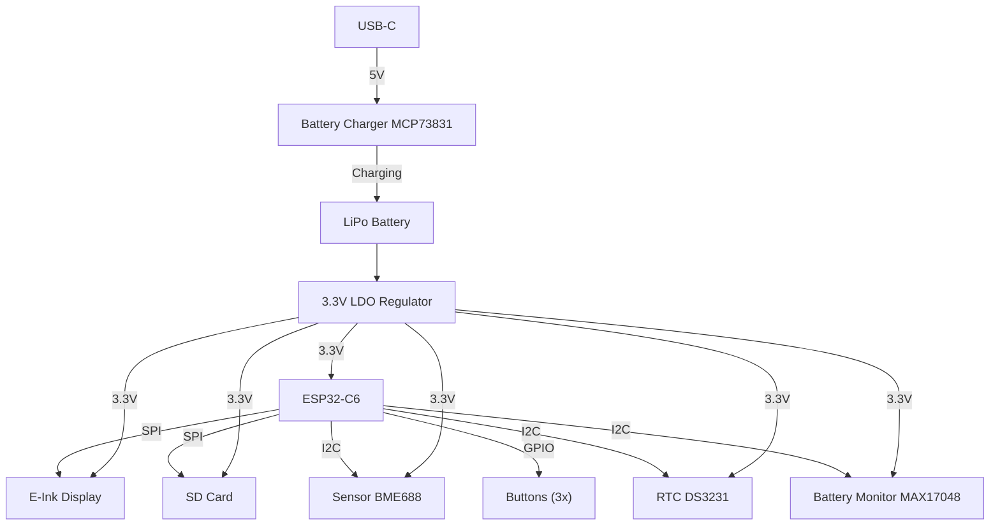

# OpenBook – Proiect TSC 2025

Acest proiect reprezinta un prototip de eBook reader open-source, construit in jurul microcontrolerului ESP32-C6 si echipat cu afisaj E-Ink, baterie Li-Po, incarcare prin USB-C, slot microSD si senzori de mediu. Proiectul a inclus realizarea schemei electrice, a placii PCB, a modelului 3D complet si a fisierelor pentru fabricatie.

---

## Diagrama bloc

---

## Functionalitate hardware

- **ESP32-C6** gestioneaza toate perifericele prin GPIO, SPI si I2C
- **Afisajul E-Ink** este controlat prin SPI si are semnale dedicate pentru RESET, DC si BUSY
- **Bateria Li-Po** este incarcata printr-un controler MCP73831 si monitorizata cu MAX17048
- **Senzorul BME688** masoara temperatura, umiditatea, presiunea si compusii volatili
- **Modulul RTC DS3231** mentine ora exacta si permite deep sleep eficient
- **Cardul microSD** este conectat la aceeasi magistrala SPI
- Toate componentele sunt montate pe layer-ul TOP si rutarea este realizata in 2 straturi

---

## Pinout ESP32-C6

| Componenta         | Pin ESP32-C6 | Interfata |
|--------------------|--------------|-----------|
| E-Ink BUSY         | IO3          | GPIO      |
| E-Ink DC           | IO5          | GPIO      |
| E-Ink RESET        | IO23         | GPIO      |
| E-Ink CS           | IO10         | SPI       |
| E-Ink MOSI         | IO7          | SPI       |
| E-Ink SCK          | IO6          | SPI       |
| SD Card CS         | IO4          | SPI       |
| SD Card MISO       | IO2          | SPI       |
| I2C SDA            | IO18         | I2C       |
| I2C SCL            | IO19         | I2C       |
| Butoane            | GPIO10/11/12 | GPIO      |

---

## Fisiere incluse

- `*.sch`, `*.brd` – schema electrica si design-ul PCB
- `Gerber/` – fisiere de productie
- `3D/` – modelul 3D al PCB-ului cu toate componentele atasate (baterie, ecran, carcasa)
- `BOM.csv` – lista de componente
- `README.md` – acest fisier

---

## Observatii

- Traseele de alimentare au latimea de 0.3mm, restul traseelor 0.15mm
- PCB-ul are grosimea de 1mm si contine planuri de masa pe ambele straturi
- Conectorii, ecranul si bateria au fost integrati in modelul 3D si testati pentru incadrare in carcasa
- Carcasa a fost importata si aliniata cu PCB-ul pentru randare
- Fisierele au fost verificate cu ERC si DRC

---

## Disclaimer subtil

Proiectul a fost realizat cu efort considerabil si rabdare extinsa, mai ales in interactiunea cu interfata Fusion 360. Satisfactia finala a fost proportionala cu cantitatea de workaround-uri folosite.

---

## Bill of Materials

|   Qty | Value                                                                          | Device                                                                         | Package                                                | Parts                                                                                                   | Description                                                                                                                                                                                                                                                                                                                                                                                                                                                                                          |
|------:|:-------------------------------------------------------------------------------|:-------------------------------------------------------------------------------|:-------------------------------------------------------|:--------------------------------------------------------------------------------------------------------|:-----------------------------------------------------------------------------------------------------------------------------------------------------------------------------------------------------------------------------------------------------------------------------------------------------------------------------------------------------------------------------------------------------------------------------------------------------------------------------------------------------|
|     1 |                                                                                | ADAFRUIT_LEDCHIP-LED0603                                                       | ADAFRUIT_CHIP-LED0603                                  | CHG_LED                                                                                                 | LED                                                                                                                                                                                                                                                                                                                                                                                                                                                                                                  |
|     1 |                                                                                | SJ                                                                             | SJ                                                     | SJ1                                                                                                     | SMD solder JUMPER                                                                                                                                                                                                                                                                                                                                                                                                                                                                                    |
|     1 | 0.47                                                                           | ESP32_WROVER_EAGLE-LTSPICE_RR0402                                              | ESP32_WROVER_EAGLE-LTSPICE_R0402                       | R3                                                                                                      | RESISTOR, European symbol                                                                                                                                                                                                                                                                                                                                                                                                                                                                            |
|     1 | 100k                                                                           | ESP32_WROVER_EAGLE-LTSPICE_RR0402                                              | ESP32_WROVER_EAGLE-LTSPICE_R0402                       | R1_PWRUSB                                                                                               | RESISTOR, European symbol                                                                                                                                                                                                                                                                                                                                                                                                                                                                            |
|     7 | 100nF                                                                          | EAGLE-LTSPICE_CC0402                                                           | EAGLE-LTSPICE_C0402                                    | C1, C2, C4_USB, C6, C8, C10, C_DELAY                                                                    | CAPACITOR, European symbol                                                                                                                                                                                                                                                                                                                                                                                                                                                                           |
|     1 | 100uF                                                                          | EAGLE-LTSPICE_CC0402                                                           | EAGLE-LTSPICE_C0402                                    | C9                                                                                                      | CAPACITOR, European symbol                                                                                                                                                                                                                                                                                                                                                                                                                                                                           |
|     1 | 100uF                                                                          | RCL_CPOL-EUCT3528                                                              | RCL_CT3528                                             | C3                                                                                                      | POLARIZED CAPACITOR, European symbol                                                                                                                                                                                                                                                                                                                                                                                                                                                                 |
|    16 | 10k                                                                            | ESP32_WROVER_EAGLE-LTSPICE_RR0402                                              | ESP32_WROVER_EAGLE-LTSPICE_R0402                       | R1, R1_PINH, R1_PINH1, R2_PINH, R2_PINH1, R4, R5, R6, R7, R8, R9, R10, R_BOOT, R_CHANGE, R_CL1, R_RESET | RESISTOR, European symbol                                                                                                                                                                                                                                                                                                                                                                                                                                                                            |
|     1 | 10uF                                                                           | EAGLE-LTSPICE_CC0402                                                           | EAGLE-LTSPICE_C0402                                    | C7                                                                                                      | CAPACITOR, European symbol                                                                                                                                                                                                                                                                                                                                                                                                                                                                           |
|     1 | 112A-TAAR-R03_ATTEND                                                           | 112A-TAAR-R03_ATTEND                                                           | 112ATAARR03ATTEND                                      | J4                                                                                                      | Micro SD Card Socket, Push-Push Type, Top Mount, SMT, H=1.83mm, 10u                                                                                                                                                                                                                                                                                                                                                                                                                                  |
|     1 | 15                                                                             | ESP32_WROVER_EAGLE-LTSPICE_RR0402                                              | ESP32_WROVER_EAGLE-LTSPICE_R0402                       | R_CAPACITOR                                                                                             | RESISTOR, European symbol                                                                                                                                                                                                                                                                                                                                                                                                                                                                            |
|     1 | 1uF                                                                            | EAGLE-LTSPICE_CC0402                                                           | EAGLE-LTSPICE_C0402                                    | C5                                                                                                      | CAPACITOR, European symbol                                                                                                                                                                                                                                                                                                                                                                                                                                                                           |
|    10 | 1uF/50V                                                                        | EAGLE-LTSPICE_CC0402                                                           | EAGLE-LTSPICE_C0402                                    | EPD_C1, EPD_C2, EPD_C5, EPD_C6, EPD_C7, EPD_C8, EPD_C9, EPD_C10, EPD_C11, EPD_C12                       | CAPACITOR, European symbol                                                                                                                                                                                                                                                                                                                                                                                                                                                                           |
|     1 | 2.2                                                                            | ESP32_WROVER_EAGLE-LTSPICE_RR0402                                              | ESP32_WROVER_EAGLE-LTSPICE_R0402                       | R2                                                                                                      | RESISTOR, European symbol                                                                                                                                                                                                                                                                                                                                                                                                                                                                            |
|     1 | 200                                                                            | ESP32_WROVER_EAGLE-LTSPICE_RR0402                                              | ESP32_WROVER_EAGLE-LTSPICE_R0402                       | R1_BAT                                                                                                  | RESISTOR, European symbol                                                                                                                                                                                                                                                                                                                                                                                                                                                                            |
|     2 | 20V/4.2A/52mO/1.4W                                                             | ESP32_WROVER_SPARKFUN-DISCRETESEMI_MOSFET_PCH-DMG2305UX-7                      | ESP32_WROVER_SPARKFUN-DISCRETESEMI_SOT23-3             | Q1, Q2                                                                                                  | P-channel MOSFETs                                                                                                                                                                                                                                                                                                                                                                                                                                                                                    |
|     1 | 2k                                                                             | ESP32_WROVER_EAGLE-LTSPICE_RR0402                                              | ESP32_WROVER_EAGLE-LTSPICE_R0402                       | R2_BAT                                                                                                  | RESISTOR, European symbol                                                                                                                                                                                                                                                                                                                                                                                                                                                                            |
|     5 | 4.7uF                                                                          | EAGLE-LTSPICE_CC0402                                                           | EAGLE-LTSPICE_C0402                                    | C1_BAT, C1_BAT1, C1_BAT2, C2_BAT, C5_USB                                                                | CAPACITOR, European symbol                                                                                                                                                                                                                                                                                                                                                                                                                                                                           |
|     1 | 4.7uF/25V                                                                      | EAGLE-LTSPICE_CC0402                                                           | EAGLE-LTSPICE_C0402                                    | C4                                                                                                      | CAPACITOR, European symbol                                                                                                                                                                                                                                                                                                                                                                                                                                                                           |
|     2 | 5k1                                                                            | ESP32_WROVER_EAGLE-LTSPICE_RR0402                                              | ESP32_WROVER_EAGLE-LTSPICE_R0402                       | R2-USB, R2-USB1                                                                                         | RESISTOR, European symbol                                                                                                                                                                                                                                                                                                                                                                                                                                                                            |
|     1 | 68uH                                                                           | 744043680IND_4828-WE-TPC_WRE                                                   | IND_4828-WE-TPC_WRE                                    | L1                                                                                                      |                                                                                                                                                                                                                                                                                                                                                                                                                                                                                                      |
|     1 | BD5229G-TR                                                                     | BD5229G-TR                                                                     | SOT95P280X125-5N                                       | IC1                                                                                                     | Voltage Detector with Adjustable Delay Time: CMOS processes are utilized to develop high precision, low current consumption CMOS reset ICs that allow arbitrary setting of the delay time. The extensive lineup includes both Nch Open Drain and CMOS output types in a wide range of detection voltages (from 2.3V to 6.0V, in 0.1V steps), enabling selection of the ideal solution based on customer requirements. In addition, the entire series is of course both lead-free and RoHS-compliant. |
|     3 | BUTTON_CUSYOMV1                                                                | BUTTON_CUSYOMV1                                                                | MYBUTTON                                               | BOOT_BUTTON, CHANGE_BUTTON, RESET_BUTTON                                                                |                                                                                                                                                                                                                                                                                                                                                                                                                                                                                                      |
|     1 | CPH3225A                                                                       | CPH3225A                                                                       | CAPCP3225X100N                                         | C10_SUPERCAP                                                                                            | Cap 0.011F 3.3V 1210 Flat Check availability                                                                                                                                                                                                                                                                                                                                                                                                                                                         |
|     1 | DS3231SN#                                                                      | DS3231SN#                                                                      | SOIC127P1032X265-16N                                   | U3                                                                                                      | Real Time Clock Serial 16-Pin SOIC W T/R     Check availability                                                                                                                                                                                                                                                                                                                                                                                                                                      |
|     1 | ESP32-C6-WROOM-1-N8                                                            | ESP32-C6-WROOM-1-N8                                                            | XCVR_ESP32-C6-WROOM-1-N8                               | U2                                                                                                      | Check availability                                                                                                                                                                                                                                                                                                                                                                                                                                                                                   |
|     1 | ESP32C6_VARISTORCN1812                                                         | ESP32C6_VARISTORCN1812                                                         | ESP32C6_VARISTOR_CT/CN1812                             | PFMF.050.1                                                                                              | VARISTOR                                                                                                                                                                                                                                                                                                                                                                                                                                                                                             |
|     2 | ESP32_WROVER_AVX---SD0805S020S1R0_AVX_SD0805S020S1R0_0_0AVX_SD0805S020S1R0_0_0 | ESP32_WROVER_AVX---SD0805S020S1R0_AVX_SD0805S020S1R0_0_0AVX_SD0805S020S1R0_0_0 | ESP32_WROVER_AVX---SD0805S020S1R0_AVX_SD0805S020S1R0_0 | D2, D7                                                                                                  | Schottky Barrier Rectifier Diode                                                                                                                                                                                                                                                                                                                                                                                                                                                                     |
|     1 | ESP32_WROVER_BME680_BME680                                                     | ESP32_WROVER_BME680_BME680                                                     | ESP32_WROVER_BME680_PSON80P300X300X100-8N              | SENSOR2                                                                                                 | Integrated Environmental Unit                                                                                                                                                                                                                                                                                                                                                                                                                                                                        |
|     1 | ESP32_WROVER_SPARKFUN-IC-POWER_MCP73831                                        | ESP32_WROVER_SPARKFUN-IC-POWER_MCP73831                                        | ESP32_WROVER_SPARKFUN-IC-POWER_SOT23-5                 | MCP73831                                                                                                | MCP73831T Li-Ion, Li-Pol Controller                                                                                                                                                                                                                                                                                                                                                                                                                                                                  |
|     1 | FH34SRJ-24S-0.5SH_99_                                                          | FH34SRJ-24S-0.5SH_99_                                                          | FH34SRJ24S05SH99                                       | J1                                                                                                      | (0.50mm) Surface Mount, Right Angle                                                                                                                                                                                                                                                                                                                                                                                                                                                                  |
|     1 | MAX17048G+T10                                                                  | MAX17048G+T10                                                                  | SON50P200X200X80-9N                                    | U4                                                                                                      | Check availability                                                                                                                                                                                                                                                                                                                                                                                                                                                                                   |
|     3 | MBR0530                                                                        | MBR0530                                                                        | SOD3716X135N                                           | D3, D4, D5                                                                                              | ON SEMICONDUCTOR - MBR0530 - DIODE, SCHOTTKY, 0.5A, 30V, SOD-123                                                                                                                                                                                                                                                                                                                                                                                                                                     |
|     6 | PGB1010603MR                                                                   | PGB1010603MR                                                                   | DIOC1608X36N                                           | D6, D8, D9, D10, D11, D12                                                                               | Check availability                                                                                                                                                                                                                                                                                                                                                                                                                                                                                   |
|     1 | QWIIC_RIGHT_ANGLE                                                              | QWIIC_CONNECTORJS-1MM                                                          | JST04_1MM_RA                                           | J3                                                                                                      | SparkFun I2C Standard Qwiic Connector                                                                                                                                                                                                                                                                                                                                                                                                                                                                |
|     1 | SAMACSYS_PARTS_USB4110-GF-A                                                    | SAMACSYS_PARTS_USB4110-GF-A                                                    | SAMACSYS_PARTS_USB4110GFA                              | J2                                                                                                      | CONN USB 2.0 TYPE-C R/A SMT                                                                                                                                                                                                                                                                                                                                                                                                                                                                          |
|     1 | SI1308EDL-T1-GE3                                                               | SI1308EDL-T1-GE3                                                               | SOT65P210X110-3N                                       | Q3                                                                                                      | MOSFET N-Ch 30V 1.5A TrenchFET SC70 Vishay Si1308EDL-T1-GE3 N-channel MOSFET Transistor, 1.5 A, 30 V, 3-Pin SC-70                                                                                                                                                                                                                                                                                                                                                                                    |
|    17 | TPTP20R                                                                        | TPTP20R                                                                        | TP20R                                                  | TP1, TP2, TP3, TP4, TP5, TP6, TP7, TP8, TP9, TP10, TP11, TP12, TP13, TP14, TP15, TP16, TP17             | Test pad                                                                                                                                                                                                                                                                                                                                                                                                                                                                                             |
|     1 | USBLC6-2SC6Y                                                                   | USBLC6-2SC6Y                                                                   | SOT95P280X145-6N                                       | D1                                                                                                      | Low Cap. ESD Protection Auto SOT-23-6 STMicroelectronics USBLC6-2SC6Y, Dual Uni-Directional TVS Diode Array, 6-Pin SOT-23                                                                                                                                                                                                                                                                                                                                                                            |
|     1 | W25Q512JVEIQ                                                                   | W25Q512JVEIQ                                                                   | SON127P600X800X80-9N                                   | U1                                                                                                      | Check availability                                                                                                                                                                                                                                                                                                                                                                                                                                                                                   |
|     1 | XC6220A331MR-G                                                                 | XC6220A331MR-G                                                                 | SOT95P280X120-5N                                       | IC4                                                                                                     | LDO Voltage Regulators                                                                                                                                                                                                                                                                                                                                                                                                                                                                               |
