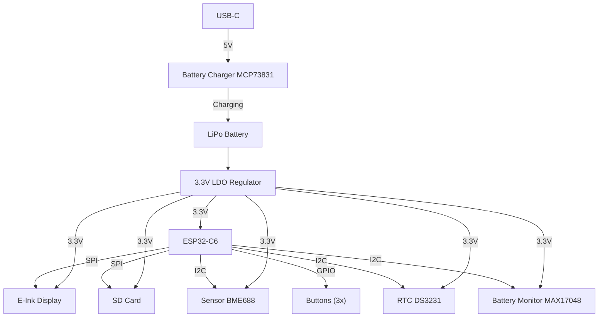

# OpenBook – Proiect TSC 2025

Acest proiect reprezinta un prototip de eBook reader open-source, construit in jurul microcontrolerului ESP32-C6 si echipat cu afisaj E-Ink, baterie Li-Po, incarcare prin USB-C, slot microSD si senzori de mediu. Proiectul a inclus realizarea schemei electrice, a placii PCB, a modelului 3D complet si a fisierelor pentru fabricatie.

---

## Diagrama bloc

---

## Functionalitate hardware

- **ESP32-C6** gestioneaza toate perifericele prin GPIO, SPI si I2C
- **Afisajul E-Ink** este controlat prin SPI si are semnale dedicate pentru RESET, DC si BUSY
- **Bateria Li-Po** este incarcata printr-un controler MCP73831 si monitorizata cu MAX17048
- **Senzorul BME688** masoara temperatura, umiditatea, presiunea si compusii volatili
- **Modulul RTC DS3231** mentine ora exacta si permite deep sleep eficient
- **Cardul microSD** este conectat la aceeasi magistrala SPI
- Toate componentele sunt montate pe layer-ul TOP si rutarea este realizata in 2 straturi

---

## Pinout ESP32-C6

| Componenta         | Pin ESP32-C6 | Interfata |
|--------------------|--------------|-----------|
| E-Ink BUSY         | IO3          | GPIO      |
| E-Ink DC           | IO5          | GPIO      |
| E-Ink RESET        | IO23         | GPIO      |
| E-Ink CS           | IO10         | SPI       |
| E-Ink MOSI         | IO7          | SPI       |
| E-Ink SCK          | IO6          | SPI       |
| SD Card CS         | IO4          | SPI       |
| SD Card MISO       | IO2          | SPI       |
| I2C SDA            | IO18         | I2C       |
| I2C SCL            | IO19         | I2C       |
| Butoane            | GPIO10/11/12 | GPIO      |

---

## Fisiere incluse

- `*.sch`, `*.brd` – schema electrica si design-ul PCB
- `Gerber/` – fisiere de productie
- `3D/` – modelul 3D al PCB-ului cu toate componentele atasate (baterie, ecran, carcasa)
- `BOM.csv` – lista de componente
- `README.md` – acest fisier

---

## Observatii

- Traseele de alimentare au latimea de 0.3mm, restul traseelor 0.15mm
- PCB-ul are grosimea de 1mm si contine planuri de masa pe ambele straturi
- Conectorii, ecranul si bateria au fost integrati in modelul 3D si testati pentru incadrare in carcasa
- Carcasa a fost importata si aliniata cu PCB-ul pentru randare
- Fisierele au fost verificate cu ERC si DRC

---

## Disclaimer subtil

Proiectul a fost realizat cu efort considerabil si rabdare extinsa, mai ales in interactiunea cu interfata Fusion 360. Satisfactia finala a fost proportionala cu cantitatea de workaround-uri folosite.

---

## Bill of Materials

| Description                                                                                                                                                                                                                                                                                                                                                                                                                                                                                          |
|:-----------------------------------------------------------------------------------------------------------------------------------------------------------------------------------------------------------------------------------------------------------------------------------------------------------------------------------------------------------------------------------------------------------------------------------------------------------------------------------------------------|
| LED                                                                                                                                                                                                                                                                                                                                                                                                                                                                                                  |
| SMD solder JUMPER                                                                                                                                                                                                                                                                                                                                                                                                                                                                                    |
| RESISTOR, European symbol                                                                                                                                                                                                                                                                                                                                                                                                                                                                            |
| RESISTOR, European symbol                                                                                                                                                                                                                                                                                                                                                                                                                                                                            |
| CAPACITOR, European symbol                                                                                                                                                                                                                                                                                                                                                                                                                                                                           |
| CAPACITOR, European symbol                                                                                                                                                                                                                                                                                                                                                                                                                                                                           |
| POLARIZED CAPACITOR, European symbol                                                                                                                                                                                                                                                                                                                                                                                                                                                                 |
| RESISTOR, European symbol                                                                                                                                                                                                                                                                                                                                                                                                                                                                            |
| CAPACITOR, European symbol                                                                                                                                                                                                                                                                                                                                                                                                                                                                           |
| Micro SD Card Socket, Push-Push Type, Top Mount, SMT, H=1.83mm, 10u                                                                                                                                                                                                                                                                                                                                                                                                                                  |
| RESISTOR, European symbol                                                                                                                                                                                                                                                                                                                                                                                                                                                                            |
| CAPACITOR, European symbol                                                                                                                                                                                                                                                                                                                                                                                                                                                                           |
| CAPACITOR, European symbol                                                                                                                                                                                                                                                                                                                                                                                                                                                                           |
| RESISTOR, European symbol                                                                                                                                                                                                                                                                                                                                                                                                                                                                            |
| RESISTOR, European symbol                                                                                                                                                                                                                                                                                                                                                                                                                                                                            |
| P-channel MOSFETs                                                                                                                                                                                                                                                                                                                                                                                                                                                                                    |
| RESISTOR, European symbol                                                                                                                                                                                                                                                                                                                                                                                                                                                                            |
| CAPACITOR, European symbol                                                                                                                                                                                                                                                                                                                                                                                                                                                                           |
| CAPACITOR, European symbol                                                                                                                                                                                                                                                                                                                                                                                                                                                                           |
| RESISTOR, European symbol                                                                                                                                                                                                                                                                                                                                                                                                                                                                            |
| nan                                                                                                                                                                                                                                                                                                                                                                                                                                                                                                  |
| Voltage Detector with Adjustable Delay Time: CMOS processes are utilized to develop high precision, low current consumption CMOS reset ICs that allow arbitrary setting of the delay time. The extensive lineup includes both Nch Open Drain and CMOS output types in a wide range of detection voltages (from 2.3V to 6.0V, in 0.1V steps), enabling selection of the ideal solution based on customer requirements. In addition, the entire series is of course both lead-free and RoHS-compliant. |
| nan                                                                                                                                                                                                                                                                                                                                                                                                                                                                                                  |
| Cap 0.011F 3.3V 1210 Flat Check availability                                                                                                                                                                                                                                                                                                                                                                                                                                                         |
| Real Time Clock Serial 16-Pin SOIC W T/R     Check availability                                                                                                                                                                                                                                                                                                                                                                                                                                      |
| Check availability                                                                                                                                                                                                                                                                                                                                                                                                                                                                                   |
| VARISTOR                                                                                                                                                                                                                                                                                                                                                                                                                                                                                             |
| Schottky Barrier Rectifier Diode                                                                                                                                                                                                                                                                                                                                                                                                                                                                     |
| Integrated Environmental Unit                                                                                                                                                                                                                                                                                                                                                                                                                                                                        |
| MCP73831T Li-Ion, Li-Pol Controller                                                                                                                                                                                                                                                                                                                                                                                                                                                                  |
| (0.50mm) Surface Mount, Right Angle                                                                                                                                                                                                                                                                                                                                                                                                                                                                  |
| Check availability                                                                                                                                                                                                                                                                                                                                                                                                                                                                                   |
| ON SEMICONDUCTOR - MBR0530 - DIODE, SCHOTTKY, 0.5A, 30V, SOD-123                                                                                                                                                                                                                                                                                                                                                                                                                                     |
| Check availability                                                                                                                                                                                                                                                                                                                                                                                                                                                                                   |
| SparkFun I2C Standard Qwiic Connector                                                                                                                                                                                                                                                                                                                                                                                                                                                                |
| CONN USB 2.0 TYPE-C R/A SMT                                                                                                                                                                                                                                                                                                                                                                                                                                                                          |
| MOSFET N-Ch 30V 1.5A TrenchFET SC70 Vishay Si1308EDL-T1-GE3 N-channel MOSFET Transistor, 1.5 A, 30 V, 3-Pin SC-70                                                                                                                                                                                                                                                                                                                                                                                    |
| Test pad                                                                                                                                                                                                                                                                                                                                                                                                                                                                                             |
| Low Cap. ESD Protection Auto SOT-23-6 STMicroelectronics USBLC6-2SC6Y, Dual Uni-Directional TVS Diode Array, 6-Pin SOT-23                                                                                                                                                                                                                                                                                                                                                                            |
| Check availability                                                                                                                                                                                                                                                                                                                                                                                                                                                                                   |
| LDO Voltage Regulators                                                                                                                                                                                                                                                                                                                                                                                                                                                                               |
