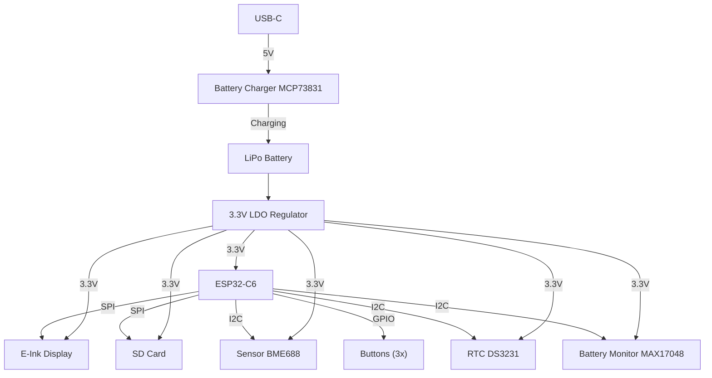

# OpenBook – Proiect TSC 2025

Acest proiect reprezinta un prototip de eBook reader open-source, construit in jurul microcontrolerului ESP32-C6 si echipat cu afisaj E-Ink, baterie Li-Po, incarcare prin USB-C, slot microSD si senzori de mediu. Proiectul a inclus realizarea schemei electrice, a placii PCB, a modelului 3D complet si a fisierelor pentru fabricatie.

---

## Diagrama bloc

```mermaid
flowchart TB
  USB-C -->|5V| CHG["Battery Charger MCP73831"]
  CHG -->|Charging| BAT["LiPo Battery"]
  BAT --> LDO["3.3V LDO Regulator"]
  LDO -->|3.3V| ESP["ESP32-C6"]
  LDO -->|3.3V| EPD["E-Ink Display"]
  LDO -->|3.3V| SD["SD Card"]
  LDO -->|3.3V| BME["Sensor BME688"]
  LDO -->|3.3V| RTC["RTC DS3231"]
  LDO -->|3.3V| MAX["Battery Monitor MAX17048"]
  
  ESP -- SPI --> EPD
  ESP -- SPI --> SD
  ESP -- I2C --> BME
  ESP -- I2C --> RTC
  ESP -- I2C --> MAX
  ESP -- GPIO --> BTN["Buttons (3x)"]
```

---

## Functionalitate hardware

- **ESP32-C6** gestioneaza toate perifericele prin GPIO, SPI si I2C
- **Afisajul E-Ink** este controlat prin SPI si are semnale dedicate pentru RESET, DC si BUSY
- **Bateria Li-Po** este incarcata printr-un controler MCP73831 si monitorizata cu MAX17048
- **Senzorul BME688** masoara temperatura, umiditatea, presiunea si compusii volatili
- **Modulul RTC DS3231** mentine ora exacta si permite deep sleep eficient
- **Cardul microSD** este conectat la aceeasi magistrala SPI
- Toate componentele sunt montate pe layer-ul TOP si rutarea este realizata in 2 straturi

---

## Pinout ESP32-C6

| Componenta         | Pin ESP32-C6 | Interfata |
|--------------------|--------------|-----------|
| E-Ink BUSY         | IO3          | GPIO      |
| E-Ink DC           | IO5          | GPIO      |
| E-Ink RESET        | IO23         | GPIO      |
| E-Ink CS           | IO10         | SPI       |
| E-Ink MOSI         | IO7          | SPI       |
| E-Ink SCK          | IO6          | SPI       |
| SD Card CS         | IO4          | SPI       |
| SD Card MISO       | IO2          | SPI       |
| I2C SDA            | IO18         | I2C       |
| I2C SCL            | IO19         | I2C       |
| Butoane            | GPIO10/11/12 | GPIO      |

---

## Fisiere incluse

- `*.sch`, `*.brd` – schema electrica si design-ul PCB
- `Gerber/` – fisiere de productie
- `3D/` – modelul 3D al PCB-ului cu toate componentele atasate (baterie, ecran, carcasa)
- `BOM.csv` – lista de componente
- `README.md` – acest fisier

---

## Observatii

- Traseele de alimentare au latimea de 0.3mm, restul traseelor 0.15mm
- PCB-ul are grosimea de 1mm si contine planuri de masa pe ambele straturi
- Conectorii, ecranul si bateria au fost integrati in modelul 3D si testati pentru incadrare in carcasa
- Carcasa a fost importata si aliniata cu PCB-ul pentru randare
- Fisierele au fost verificate cu ERC si DRC

---

## Disclaimer subtil

Am invatat multe lucruri din acest proiect. Unele despre proiectare electronica. Majoritatea despre autocontrol.

---

# Bill of Materials
| Componenta    | Link | Datasheet
| -------- | ------- |--------|
|ESP32_WROVER_BME680_BME680|https://www.snapeda.com/parts/BME680/Bosch/view-part/?welcome=home|https://www.snapeda.com/parts/BME680/Bosch%20Sensortec/datasheet/|
|ESP32_WROVER_EAGLE-LTSPICE_CC0402|https://componentsearchengine.com/Datasheets/2/CC0402MRX5R5BB106.pdf|https://componentsearchengine.com/part-view/CC0402MRX5R5BB106/YAGEO|
|ESP32_WROVER_SPARKFUN-DISCRETESEMI_MOSFET_PCH-DMG2305UX-7|https://componentsearchengine.com/part-view/DMG2305UX-7/Diodes%20Incorporated|https://www.diodes.com//assets/Datasheets/DMG2305UX.pdf|
|ESP32C6_VARISTORCN1812|https://www.mouser.co.uk/ProductDetail/EPCOS-TDK/B72520T0350K062?qs=dEfas%2FXlABIszF52uu7vrg%3D%3D|https://www.tdk-electronics.tdk.com/inf/75/db/CTVS_14/Surge_protection_series.pdf|
|FH34SRJ-24S-0.5SH_99_|https://componentsearchengine.com/part-view/XC6220A331MR-G/Torex|https://product.torexsemi.com/system/files/series/xc6220.pdf|
|MAX17048G+T10|https://www.snapeda.com/parts/MAX17048G+T10/Analog+Devices/view-part/?ref=eda|https://www.snapeda.com/parts/MAX17048G+T10/Analog%20Devices/datasheet/|
|MBR0530|https://ro.mouser.com/ProductDetail/KYOCERA-AVX/SD0805S020S1R0?qs=jCA%252BPfw4LHbpkAoSnwrdjw%3D%3D|https://ro.mouser.com/datasheet/2/40/schottky-3165252.pdf|
|PGB1010603MR|https://www.snapeda.com/parts/PGB1010603MR/Littelfuse/view-part/?ref=eda|https://www.snapeda.com/parts/PGB1010603MR/Littelfuse%20Inc./datasheet/|
|RCL_CPOL-EUCT3528|https://ro.mouser.com/ProductDetail/Vishay-Sprague/TR3B106K025C1300?qs=jCGqFXxTmLdffnuDkXzk1g%3D%3D|https://www.vishay.com/docs/40080/tr3.pdf|
|SAMACSYS_PARTS_USB4110-GF-A|https://componentsearchengine.com/part-view/USB4110-GF-A/GCT%20(GLOBAL%20CONNECTOR%20TECHNOLOGY)|https://gct.co/files/drawings/usb4110.pdf|
|SI1308EDL-T1-GE3|https://componentsearchengine.com/part-view/SI1308EDL-T1-GE3/Vishay|https://componentsearchengine.com/Datasheets/1/SI1308EDL-T1-GE3.pdf|
|SJ|https://grabcad.com/library/solder-jumpers-1||
|USBLC6-2SC6Y|https://www.snapeda.com/parts/USBLC6-2SC6Y/STMicroelectronics/view-part/?ref=eda|https://www.snapeda.com/parts/USBLC6-2SC6Y/STMicroelectronics/datasheet/|
|W25Q512JVEIQ|https://www.snapeda.com/parts/W25Q512JVEIQ/Winbond+Electronics/view-part/?ref=eda|https://www.snapeda.com/parts/W25Q512JVEIQ/Winbond%20Electronics/datasheet/|
|XC6220A331MR-G|https://componentsearchengine.com/part-view/XC6220A331MR-G/Torex|https://product.torexsemi.com/system/files/series/xc6220.pdf|
| ESP32_WROVER_EAGLE-LTSPICE_RR0402  | https://www.snapeda.com/parts/RC0402FR-07226RL/Yageo/view-part/    |https://www.snapeda.com/parts/RC0402FR-07226RL/Yageo/datasheet/
| QWIIC_CONNECTORJS-1MM | https://www.snapeda.com/parts/PRT-14417/SparkFun/view-part/     |https://www.snapeda.com/parts/PRT-14417/SparkFun%20Electronics/datasheet/
|BUTTON_CUSYOMV1|https://industry.panasonic.com/global/en/downloads?tab=cad&small_g_cd=203&part_no=EVQPUJ02K&q=RVZRUFVKMDJLJTdDMTMlN0MyMDMlN0MzNDU5JTdDMSU3QyU3QyU3Q2ZhbHNl|https://industry.panasonic.com/global/en/downloads?tab=catalog&small_g_cd=203&part_no=EVQPUJ02K&q=RVZRUFVKMDJLJTdDMTMlN0MyMDMlN0MzNDU5JTdDMSU3QyU3QzIlN0NmYWxzZQ%3D%3D
|ESP32_WROVER_EAGLE-LTSPICE_CC0402|https://componentsearchengine.com/part-view/CC0402MRX5R5BB106/YAGEO|https://componentsearchengine.com/Datasheets/2/CC0402MRX5R5BB106.pdf
|CPH3225A|https://www.snapeda.com/parts/CPH3225A/Seiko+Instruments/view-part/?ref=eda|https://www.snapeda.com/parts/CPH3225A/Seiko%20Instruments/datasheet/|
|ADAFRUIT_LEDCHIP-LED0603|https://www.snapeda.com/parts/KP-1608SURCK/Kingbright/view-part/?ref=search&t=LED%200603|https://www.snapeda.com/parts/KP-1608SURCK/Kingbright/datasheet/
|112A-TAAR-R03_ATTEND|https://store.comet.bg/en/Catalogue/Product/43497/|https://store.comet.bg/en/Catalogue/Product/43497/|
|744043680IND_4828-WE-TPC_WRE|https://www.digikey.sg/en/models/1638515|https://www.we-online.com/components/products/datasheet/744043680.pdf
|BD5229G-TR|https://componentsearchengine.com/part-view/BD5229G-TR/ROHM%20Semiconductor|https://datasheet.datasheetarchive.com/originals/distributors/Datasheets_SAMA/f2b9741ef86007909f138d561a359946.pdf|
|CPH3225A|https://www.snapeda.com/parts/CPH3225A/Seiko+Instruments/view-part/?ref=eda|https://www.snapeda.com/parts/CPH3225A/Seiko%20Instruments/datasheet/|
|DS3231SN|https://www.snapeda.com/parts/DS3231SN%23/Analog+Devices/view-part/?ref=eda|https://www.snapeda.com/parts/DS3231SN%23/Analog%20Devices/datasheet/|
|ESP32-C6-WROOM-1-N8|https://www.snapeda.com/parts/ESP32-C6-WROOM-1-N8/Espressif+Systems/view-part/?ref=eda|https://www.snapeda.com/parts/ESP32-C6-WROOM-1-N8/Espressif%20Systems/datasheet/
|MCP73831|https://www.digikey.com/en/models/1874108|https://ww1.microchip.com/downloads/aemDocuments/documents/APID/ProductDocuments/DataSheets/MCP73831-Family-Data-Sheet-DS20001984H.pdf|

---
